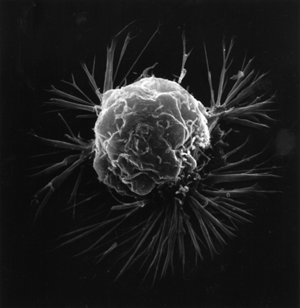

  
CONFIDENTIAL CASE FILE

  
  <a href="index.html" class="casefile-button">📁 Return to the Front</a>

  <h1 class="casefile-title">The Defendant</h1>

  

    Standing trial in <strong>Breast Cancer v. The Peopel of P8105</strong> is the accused:
    <strong>Breast Cancer</strong>. Below is the official case dossier compiled
    by the Prosecution Team.
  

  

  <section id="identity">
    <h2>1. Identity of the Defendant</h2>
    

      <strong>Legal Name:</strong> Breast Cancer (Invasive and In Situ Forms)  
      <strong>Charge Category:</strong> Malignant Neoplasm, Specializing in the Mammary Gland  
      <strong>Jurisdiction:</strong> Global – with a particular fondness for women, but not 
      exclusive to them.
    

    

      Breast Cancer has been operating for centuries, quietly infiltrating tissues,
      evading early detection, and leaving a trail of loss and suffering. In this
      proceeding, we treat it as a repeat, high-impact offender against the public’s
      health.
    

  </section>

  <section id="aliases">
    <h2>2. Known Aliases & Accomplices</h2>
    <ul>
      <li><strong>Aliases:</strong> “The Lump,” “The Lesion,” “The Shadow on the Mammogram.”</li>
      <li><strong>Molecular Alter Egos:</strong> HER2-positive, Triple-Negative, Luminal A, Luminal B.</li>
      <li><strong>Accomplices (Risk Factors):</strong>
        <ul>
          <li>Family history &amp; BRCA mutations – the inside informants.</li>
          <li>Hormonal exposures – long-term estrogen and progesterone signaling.</li>
          <li>Environmental &amp; lifestyle factors – obesity, alcohol, and inactivity playing
              supporting roles.</li>
          <li>Structural inequities – delayed screening, limited access to care, and
              under-resourced health systems.</li>
        </ul>
      </li>
    </ul>
  </section>

  <section id="charges">
    <h2>3. Formal Charges</h2>
    

      The Prosecution alleges that Breast Cancer is guilty of the following counts:
    

    <ol>
      <li>
        <strong>Count I – Premeditated Cellular Proliferation:</strong>
        Deliberate violation of normal growth controls, resulting in uncontrolled cell division.
      </li>
      <li>
        <strong>Count II – Invasion of Local Tissues:</strong>
        Breaching the basement membrane and infiltrating surrounding structures without consent.
      </li>
      <li>
        <strong>Count III – Metastatic Conspiracy:</strong>
        Coordinating distant spread to lymph nodes, bone, lung, liver, and brain with
        intent to cause systemic harm.
      </li>
      <li>
        <strong>Count IV – Disguised Presentation:</strong>
        Frequently remaining asymptomatic in early stages, exploiting delays in screening
        and diagnosis.
      </li>
      <li>
        <strong>Count V – Exacerbating Inequities:</strong>
        Disproportionately impacting marginalized communities, amplifying existing health
        disparities and inequities in outcomes.
      </li>
    </ol>
  </section>

  <section id="weaknesses">
  <h2>4. Evidence, Crime Scene & Analytic Strategy</h2>
  

    In <strong>Breast Cancer v. The Peopel of P8105</strong>, the jury is not swayed by emotion but by evidence. 
    This case file presents data that reconstructs the crime scene and tests how Breast Cancer’s 
    actions influence survival.
  

  <ul>
    <li>
      <strong>Crime Scene Reconstruction:</strong> We map the “scene” using tumor biology, 
      treatment details, and patient characteristics to understand where, how, and in whom 
      the harm occurs.
    </li>
    <li>
      <strong>Analytic Methods as Forensics:</strong> Regression models, survival analysis, 
      and machine learning serve as forensic tools to quantify the impact of key factors on 
      outcomes.
    </li>
    <li>
      <strong>Survival as the Primary Charge:</strong> We test whether specific tumor features, 
      treatments, and delays in care meaningfully alter the probability of survival — the 
      central count in this indictment.
    </li>
    <li>
      <strong>Pattern Hunting in the Evidence:</strong> By examining patterns across groups 
      (e.g., stage, subtype, demographics), we search for systematic disparities that strengthen 
      the case for guilt.
    </li>
  </ul>
  

    The core question of <strong>Breast Cancer v. The Peopel of P8105</strong> is whether these analytic investigations — 
    of the crime scene, survival, and patterns in characteristics — provide enough evidence to 
    convict Breast Cancer in the court of public health, or whether reasonable doubt remains.
  

</section>

